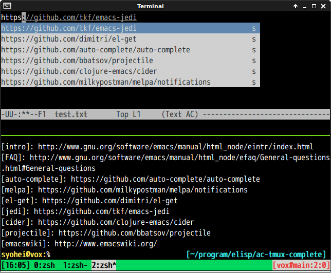

# ac-tmux-complete

Auto complete source which uses content of tmux panes for completing.
This is port of [tmux-complete.vim](https://github.com/wellle/tmux-complete.vim).


## Screenshot




## Basic Usage

#### ac-tmux-complete-ac-setup

Set up `auto-complete` source.


## Sample Configuration

```lisp
(add-hook 'text-mode-hook 'ac-tmux-complete-ac-setup)
(add-hook 'git-commit-mode-hook 'ac-tmux-complete-ac-setup)
```
